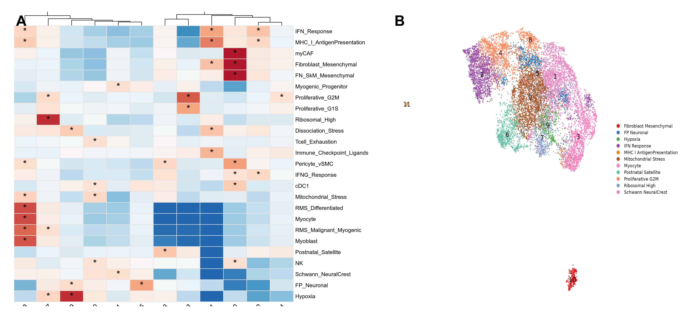

# SigClust

**Signature-based Cluster Annotation for Single-Cell RNA-seq**

SigClust statistically identifies which gene-expression signatures are over-represented in which clusters — then labels your UMAP accordingly. It works with any pre-computed signature scores (UCell, AUCell, AddModuleScore) and any clustered Seurat object.



**Panel A:** Enrichment heatmap — log₂(Odds Ratio) for every signature × cluster combination. Red = over-represented, white = no association. Asterisks (`*`) mark statistically significant enrichments (OR > 2, FDR < 0.01). Only over-representations are shown; depleted signatures are not displayed.

**Panel B:** Functional UMAP — each cluster colored by its dominant enriched signature. Grey clusters have no signature passing the enrichment threshold.

---

## Why SigClust?

| Approach | Limitation SigClust solves |
|----------|---------------------------|
| **Marker genes** (FindAllMarkers) | Tells you *which genes* are DE, not *what biological program* they represent. Requires manual literature lookup. |
| **Reference-based transfer** (SingleR, Azimuth) | Needs a high-quality labeled atlas for your tissue. Doesn't exist for many tumor types or custom states. |
| **Deconvolution** (CIBERSORTx, xCell) | Designed for bulk RNA-seq. Estimates fractions, not cluster-level annotation. |
| **GSVA/ssGSEA alone** | Gives per-cell continuous scores but no statistical test linking scores to clusters. |

SigClust is:
- **Quantitative** — enrichment measured by Odds Ratio with FDR correction, not by eye
- **Multi-label capable** — a single cluster can be significantly enriched for multiple signatures (e.g., "Macrophage" AND "Hypoxia")
- **Agnostic** — works with any signature set: immune, muscle, metabolic, tumor-intrinsic, custom NMF programs
- **Reproducible** — same inputs = same annotations every time
- **Fast** — <2 minutes for 100K cells × 40 signatures

---

## Quick Start

```r
source("sigclust_annotate.R")

# Load your clustered Seurat object and signature scores
obj    <- readRDS("my_clustered_seurat.rds")
scores <- read.csv("my_ucell_scores.csv", row.names = 1)

# Run SigClust
results <- sigclust_annotate(
  seurat_obj = obj,
  scores     = scores,
  output_dir = "my_results/",
  label      = "my_sample"
)
```

If UCell scores are already stored in your Seurat object metadata:

```r
source("sigclust_annotate.R")
obj <- readRDS("my_object.rds")

# Extract UCell columns as the scores matrix
ucell_cols <- grep("_UCell$", colnames(obj@meta.data), value = TRUE)
scores <- obj@meta.data[, ucell_cols]
colnames(scores) <- gsub("_UCell$", "", colnames(scores))

results <- sigclust_annotate(obj, scores, output_dir = "output/", label = "my_sample")
```

---

## How It Works

### Step 1: Filter irrelevant signatures

Not every signature is expressed in every dataset. A "B-cell" signature will score near-zero in a dataset of sorted tumor cells. SigClust drops any signature whose maximum score across all cells falls below 0.2 (configurable). This avoids meaningless tests and reduces the multiple-testing burden.

### Step 2: Identify "high-scoring" cells

For each retained signature, cells are ranked by score. The **top 10%** (configurable) are labeled "high" for that signature. Percentile-based thresholding makes comparisons fair across signatures with different score distributions — a 200-gene immune signature and a 15-gene hypoxia signature are treated identically.

### Step 3: Test for over-representation (Fisher's exact test)

For every (signature, cluster) pair, a 2×2 contingency table is constructed:

|  | In cluster | Not in cluster |
|--|-----------|----------------|
| **Top 10%** | a | b |
| **Bottom 90%** | c | d |

A one-sided Fisher's exact test asks: *"Are the top-scoring cells for this signature disproportionately concentrated in this cluster?"*

The **Odds Ratio (OR)** quantifies the enrichment strength:

$$OR = \frac{a \cdot d}{b \cdot c}$$

- OR = 1 → no enrichment (top cells distributed randomly)
- OR = 4 → 4× more likely to find a top-scorer in this cluster than expected
- OR = 100+ → near-complete overlap between cluster membership and top-scoring status

**Only over-representations (OR > 1) are tested and reported.** Depletion (OR < 1) is not displayed because the biological question is "what IS this cluster?", not "what is it NOT?"

### Step 4: Correct for multiple testing

All p-values are FDR-corrected (Benjamini-Hochberg) across all tests simultaneously. Default threshold: FDR < 0.01. This is deliberately strict because cluster annotations propagate to all downstream analyses.

### Step 5: Assign functional labels

A (signature, cluster) pair is considered significant if **both**:
- FDR < 0.01
- OR ≥ 2 (at minimum 2× enrichment)

Each cluster receives the label of its highest-OR significant signature. Clusters with no significant enrichment are labeled "Unassigned" (grey on UMAP). The full multi-signature profile is preserved in the output CSV — a cluster can have multiple significant signatures.

---

## Understanding the Odds Ratio

| log₂(OR) | OR | Interpretation |
|-----------|-----|---------------|
| 0 | 1 | No enrichment |
| 1 | 2 | 2× enriched — our minimum significance threshold |
| 2 | 4 | 4× enriched — moderate, biologically meaningful |
| 3 | 8 | Strong enrichment |
| 5+ | 32+ | Very strong — nearly all top cells concentrate in one cluster |
| 7+ | 128+ | Extreme — the cluster IS the cell type |

**Why are some ORs extremely high (100–500)?**

This is expected, not a bug. When Seurat's graph-based clustering groups cells by transcriptomic similarity, and your signature captures the same gene program that defined the cluster, the overlap is near-complete. Example: if cluster 5 has 305 cells and 282 are top-10% pericyte scorers (92.5% purity), the Fisher test correctly returns OR ≈ 460. This means your clustering resolution matches the biological granularity of your signatures — both methods independently found the same population.

---

## Outputs

### Figures
| File | Description |
|------|-------------|
| `*_or_heatmap.png` | Log₂(OR) enrichment heatmap. Red = over-represented, white = no association. `*` marks significant hits. Only enrichments shown. |
| `*_functional_umap.png` | UMAP colored by dominant signature per cluster |
| `*_combined_panel.png` | Publication panel: (A) heatmap + (B) UMAP |

### Tables
| File | Description |
|------|-------------|
| `*_enrichment_full.csv` | Every test result (cluster × signature): n_top_in_cluster, n_cluster, odds_ratio, p_value, fdr |
| `*_cluster_annotations.csv` | One row per cluster: dominant signature, OR, FDR, n_significant_signatures |
| `*_summary_stats.csv` | Run parameters and summary counts |

---

## Parameters

| Parameter | Default | Description | When to change |
|-----------|---------|-------------|----------------|
| `min_max_score` | 0.2 | Drop signatures with max score below this | Lower (0.1) for sparse data; raise (0.3) for cleaner results |
| `top_pct` | 0.10 | Fraction of cells considered "high" | Decrease (0.05) for sharp boundaries; increase (0.25) for gradients |
| `min_or` | 2.0 | Minimum OR for significant assignment | Raise (4.0) for strict annotation; lower (1.5) for exploratory |
| `fdr_threshold` | 0.01 | FDR significance cutoff | Rarely needs changing |
| `log2_or_display` | 1.0 | Heatmap `*` threshold | Raise (2.0) to highlight only strong enrichments |

Override any parameter:
```r
results <- sigclust_annotate(obj, scores, params = list(top_pct = 0.25, min_or = 4.0))
```

---

## Command-Line Usage

```bash
Rscript sigclust_annotate.R \
  --seurat my_object.rds \
  --scores my_scores.csv \
  --output results/ \
  --label my_sample \
  --top_pct 0.10 \
  --min_or 2 \
  --fdr 0.01
```

---

## Input Requirements

| Input | Format | Notes |
|-------|--------|-------|
| Seurat object | `.rds` with `seurat_clusters` and UMAP | Any Seurat v4/v5 object with clustering already done |
| Signature scores | Data frame or CSV | Rows = cells (matching Seurat barcodes), columns = signature names, values = continuous scores (0–1 for UCell) |

Scores can come from any method that produces per-cell continuous values:
- **UCell** (recommended) — rank-based, robust to library-size differences
- **AUCell** — area under the recovery curve
- **Seurat::AddModuleScore** — z-score relative to control genes
- **Custom** — any numeric matrix with cells as rows and signatures as columns

---

## Assumptions and Limitations

**Assumes:**
1. Your gene signatures correctly represent the biology they claim to
2. Clusters reflect biological populations (batch correction done upstream)
3. Signature scores are comparable across signatures (percentile thresholding handles scale differences)

**Limitations:**
1. Cannot discover novel cell types — only annotates using the signatures you provide
2. Resolution-dependent — annotations depend on upstream clustering resolution
3. One dominant UMAP label per cluster — the full multi-signature profile is in the CSV
4. For Visium spot-level data: still applicable, but OR values will be lower (spots are mixed) and interpretation shifts from "cell type" to "dominant program in this tissue region"

---

## Dependencies

```r
install.packages(c("Seurat", "ggplot2", "pheatmap", "patchwork", "png", "dplyr"))

# Optional (for command-line mode):
install.packages("optparse")
```

---

## Citation

If you use SigClust in your research, please cite:

```
SigClust: Signature-based cluster annotation via enrichment testing.
https://github.com/bukhariabbas/SigClust
```

---

## License

MIT
